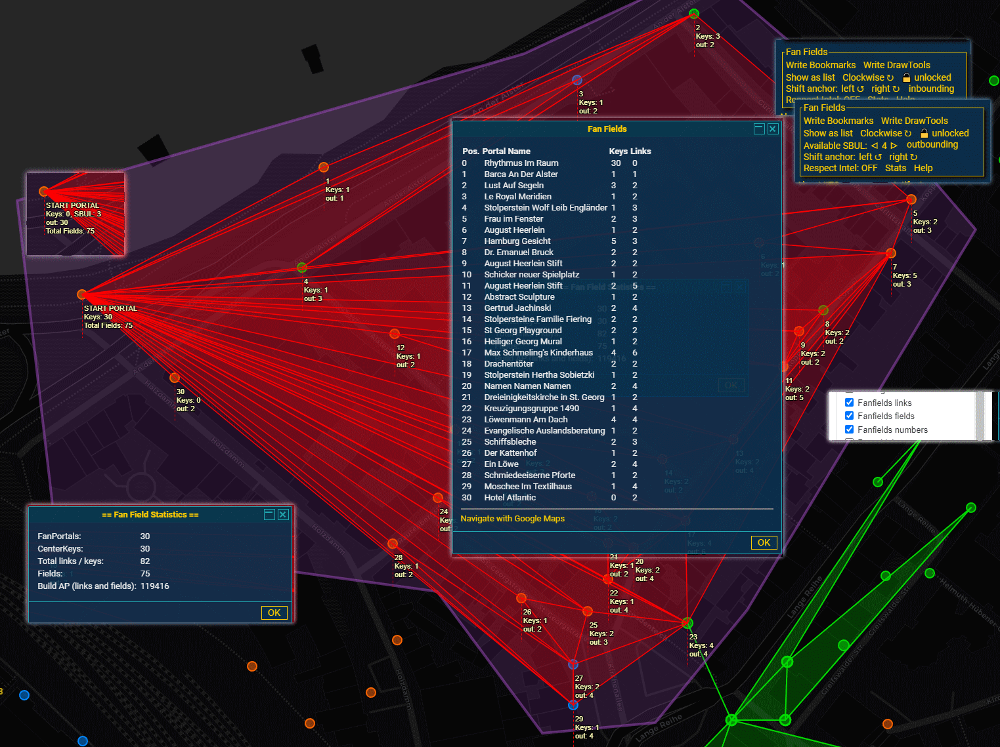

# Fan Fields 2
An INGRESS fan field planner plugin for IITC Desktop and Mobile. 

Use this plugin to easily plan your fanfields. It tells you how many keys you need for each portal, shows the total amount of fields and calculates the AP you will gain just for the links and fields. Works also for star fields and classic multilayer. Does not estimate MU, sorry for that.

## Prerequisites
### Required
- [IITC CE](https://iitc.app)
- IITC plugin: draw tools 

### Supported
- IITC plugin: Bookmarks for maps and portals
- IITC plugin: Arc
- IITC plugin: Keys

## Features
- Select portals in your area by drawing a polygon around them with DrawTools. 
- Let the magic happen: A fanfiled Plan will instantly be shown as overlay.
- Add more portals to your plan by just adding more polygons around them.
- Toggle three layers:
  - Fanfield Links
  - Fanfield Fields
  - Fanfield Numbers _(Show statistics on each portal)_
- Show the list of portals 
  - in the order to visit them
  - with the amount of keys you need
  - with the keys you already have _(if the Keys plugin is used and maintained)_
  - count of outgoing links per portal
- Open the path along the Portals in google maps.
- Tweak your plan:
  - Move the anchor portal along the hull of the area.
  - Set a marker to a portal inside the hull to make it a possible anchor. _(Yes, you can actually make a 360° fan field. Still has issues though.)_
  - Toggle the build order clockwise or anticlockwise.
  - Toggle the main direction of the fan links: inbounding or outbounding at the anchor portal?
    - Set how many SBUL you plan to use
  - Toggle the link direction indicator.
  - Show respect to the current intel and avoid throwing crosslinks. _(In some cases useful, in others not at all...)_
- Copy your plan to Drawtools Plugin.
- Copy your plan to Bookmarks Plugin.
- Copy your plan to Arcs Plugin.
- Gather Stats including Build AP. _(Currently only for links and fields, not for destroying, capturing or deploying resos and mods)_
- mobile support

## Contribute
Don't hesitate to send pull requests to the beta branch.

## Reviews
### Youtube review by Agent 57Cell
Don't miss this review by Michael Hartley:
https://www.youtube.com/watch?v=Z9TPlpnMYyI

 _Thank you, 57Cell for making awesome Ingress videos. This script wouldn't exist without your fanfields videos._

### Field report by Agent KonnTower
Agent [KonnTower](https://community.ingress.com/en/profile/KonnTower) wrote a report about his [exercise in maxfielding - ~244 fields from 89 portals](https://community.ingress.com/en/discussion/9791/an-exercise-in-maxfielding-244-fields-from-89-portals?)

_It took three years until I stumbled over this report. It made me really happy to find it._

## Tutorial Video 
english: https://youtu.be/jwn6p5xFGNY
german https://youtu.be/IFgYGUdHNcs

## Donations
The best way to say thank you is writing reports about where you used it and let me know about it.

_If you think this is great and you really like to donate something: I have all I need. But the world is not what it seems, so head out and **donate blood** in your area, register as a **bone marrow donor** or **donate money to other charities**. It will change lives._

## How it looks (on desktop)
### New sidebar design (no fieldset box anymore)

### Overview
You can still see the old fieldset box design here

### Use of Keys Plugin information

